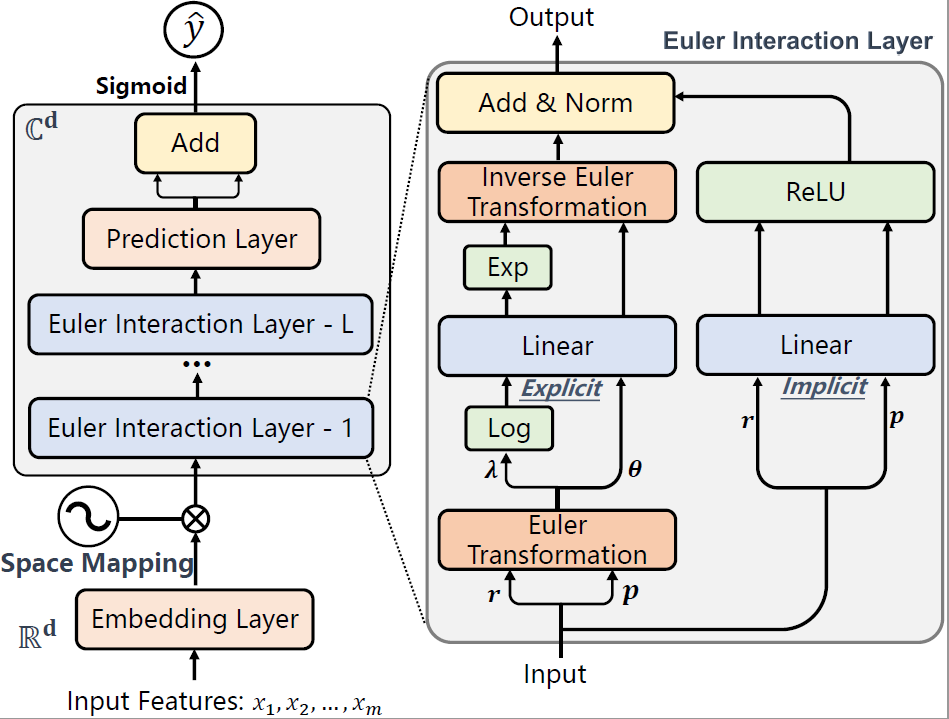

# EulerNet
[SIGIR 2023] This is the official PyTorch implementation for the paper: "EulerNet: Adaptive Feature Interaction Learning via Euler’s Formula for CTR Prediction".

<div align=center>
<div align=center> <b>The architecture of our proposed EulerNet</b>
<div align=left>

## Requirements

```
tensorflow==2.4.1
python==3.7.3
cudatoolkit==11.3.1
pytorch==1.11.0
```

## Dataset Preparation

We follow [FmFM](https://github.com/yahoo/FmFM) to process the [Criteo](http://labs.criteo.com/2014/02/kaggle-display-advertising-challenge-dataset/) and [Avazu](https://www.kaggle.com/c/avazu-ctr-prediction/data) Dataset, and follow [DCNV2](https://dl.acm.org/doi/abs/10.1145/3442381.3450078) to process the [MovieLens-1M](https://drive.google.com/drive/folders/1so0lckI6N6_niVEYaBu-LIcpOdZf99kj?usp=sharing) dataset.
The scripts for dataset processing can be found under the /DataSource folder.
You first need to download the raw dataset files and put them into the /DataSource folder.

Then pre-process the data:
```
python DataSource/[dataset]_parse.py
```

Finally, get the files for training, validation, and testing:
```
python DataSource/split.py
```

## Training

```
python train.py --config_files=[dataset].yaml
```

## Cite
If you find EulerNet useful for your research or development, please cite the following papers: [EulerNet](https://dl.acm.org/doi/10.1145/3539618.3591681).

```bibtex
@inproceedings{tian2023eulernet,
  title = {EulerNet: Adaptive Feature Interaction Learning via Euler's Formula for CTR Prediction},
  author = {Tian, Zhen and Bai, Ting and Zhao, Wayne Xin and Wen, Ji-Rong and Cao, Zhao},
  booktitle = {Proceedings of the 46th International ACM SIGIR Conference on Research and Development in Information Retrieval},
  pages = {1376–1385},
  year = {2023},
}
```
